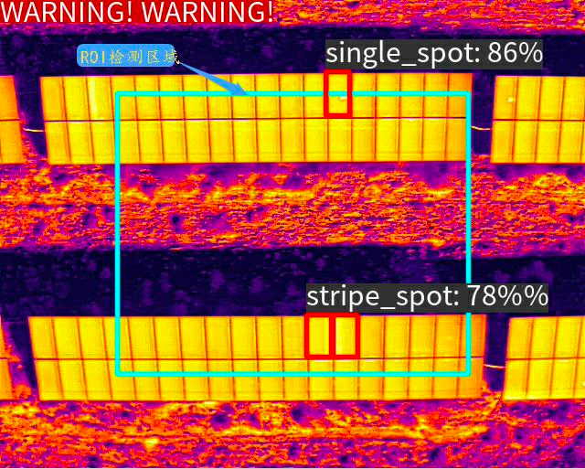

# DefectDetection (based Atlas-NPU)
## background
- Propose: Use compute vision to identify defects on photovoltaic panels, reduce labor costs and improve efficiency.

- The business logic of the algorithm alarm: the algorithm first detects the photovoltaic panel group, and then identifies whether there is a defective photovoltaic panel in it; currently there is only one kind of hot spot (subdivided into single-spot, multi-spot, and stripe spot) for the defect that needs to be identified , after the algorithm recognizes this kind of hot spot, it will generate an alarm and inform which one is single spot, multi spot or streak spot.
## Model and algorithm
### Yolov5 model
You can download the yolo pretrained model in the repo(https://github.com/ultralytics/yolov5).

### dataset 
You can get the DefectDetection dataset in the url(https://drive.google.com/file/d/1g9mIswjDHWzYIWFGluovtW64Lg_ULnHw/view?usp=share_link).

### train and evaluation
The detailed information in the directory python.
```shell
cd /workspace/github/DefectDetection/python/yolov5

echo "Prepare environment..."
pip install -i https://pypi.tuna.tsinghua.edu.cn/simple -r ../requirements.txt

echo "Processing data..."
python ../preprocess.py

echo "Start training..."
python train.py --batch-size 2 --workers 0 --epochs 300  --device "cuda:0" --data ./data/defectdetection.yaml --hyp ./data/hyps/hyp.scratch-low.yaml --weight ../model/pretrain/yolov5s.pt --img 480 --project ../model/pretrain/ --cfg ./models/yolov5s.yaml

```

### result
We construt demo api to test our model.
```bash
python python/api.py
```
You can get the final detection results as follows
```json
{
    "algorithm_data": {
        "is_alert": true,
        "target_count": 1,
        "target_info": [
            {
                "x": 0,
                "y": 259,
                "width": 396,
                "height": 121,
                "confidence": 0.373779296875,
                "name": "photovoltaic_panels"
            }
        ]
    },
    "model_data": {
        "objects": [
            {
                "x": 0,
                "y": 259,
                "width": 396,
                "height": 121,
                "confidence": 0.373779296875,
                "name": "photovoltaic_panels"
            }
        ]
    }
}

```

## Deploy

### install library dependency 
```shell
# opencv
cd  ./lib
apt install build-essential cmake ffmpeg unzip build-essential libboost-all-dev
wget https://github.com/opencv/opencv/archive/4.1.1.zip
unzip 4.1.1.zip
cd ./opencv-4.1.1
mkdir build && cd build
#cmake -DOPENCV_DOWNLOAD_MIRROR_ID=gitcode ..
cmake .. 
make -j8  && make install

# glog
cd ./lib
git clone  https://github.com/google/glog.git
cd glog/
mkdir build && cd build
cmake ..
make -j8  && make install

# gtest
cd ./lib
git clone https://github.com/google/googletest.git
cd googletest/
mkdir build && cd build
cmake ..
make -j8  && make install
```

### install our project
```shell
# compile SDK library
mkdir build && cd build
cmake .. && make install
# compile test tools
mkdir ./test/build && cd ./test/build
cmake .. && make install

# test 
./bin/test-ji-api -f 1 -i ../data/vp.jpeg -o result.jpg
```
### results

- F1-Score: 0.7355
- Performance: 61.7815

- 

## contributor
- [wfs2010](https://github.com/wfs2010)

## Thanks
Excellent computer vision learning platform: https://www.cvmart.net/
